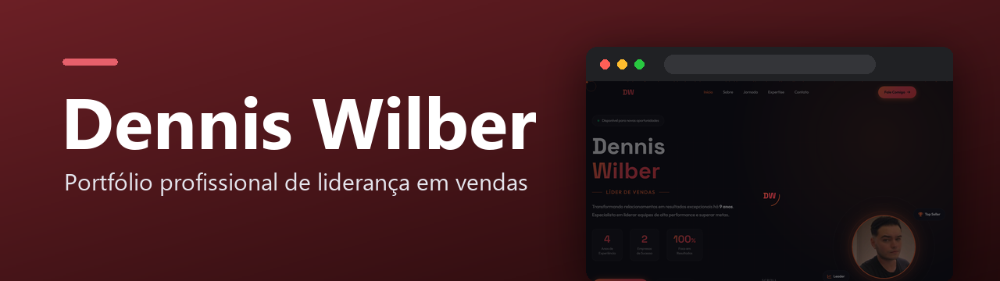
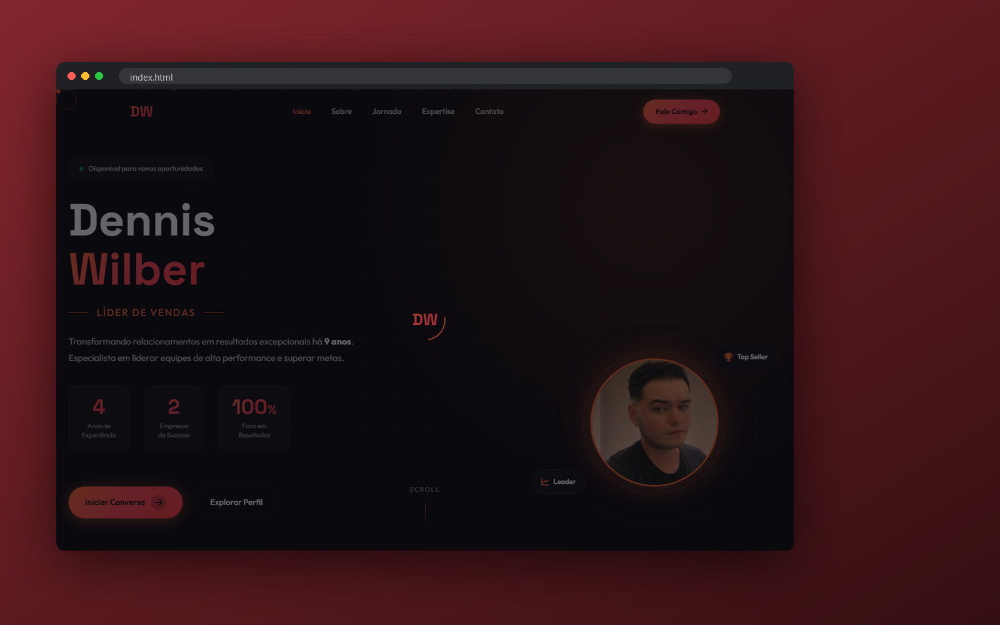

<p align="center">
  
</p>

<p align="center">
  
  <a href="https://davicjc.github.io/PortifolioDDWilber/"></a>
  
  
  
</p>

<p align="center">Portfólio profissional de Dennis Wilber, líder de vendas: trajetória, habilidades e contato.</p>


<p align="center">
  
</p>

---

## Líder de Vendas & Supervisor Comercial

Portfólio profissional moderno e responsivo desenvolvido para Dennis Wilber, líder de vendas com 9 anos de experiência no mercado.

### 🎯 Sobre o Profissional

Dennis Wilber é um profissional dedicado e orientado para resultados, com sólida experiência em liderança de vendas e gestão comercial. Atualmente atua como **Líder de Vendas no Projeto Xiaomi Brasil**, onde ingressou como vendedor em junho de 2024 e foi promovido a líder em setembro do mesmo ano, demonstrando sua capacidade excepcional de crescimento e liderança na área comercial.

### 💼 Experiência Profissional

- **Líder de Vendas** - Projeto Xiaomi Brasil (Setembro 2024 - Atual)
- **Vendedor** - Projeto Xiaomi Brasil (Junho - Setembro 2024)
- **Vendedor** - Polishop (2023 - 2024)
- **Atendente Call Center** - Algar/Caixa Capitalização (2022 - 2023)
- **Vendedor Responsável** - Pink Calçados (2018 - 2021)
- **Atendente Call Center** - Callink/Claro (2016 - 2017)

### 🛠️ Tecnologias Utilizadas

- **HTML5** - Estrutura semântica moderna
- **CSS3** - Design responsivo com Flexbox e Grid
- **JavaScript** - Interatividade e animações
- **Font Awesome** - Ícones profissionais
- **Google Fonts** - Tipografia Poppins

### ✨ Características do Portfólio

- 🎨 **Design Moderno**: Interface limpa com tema azul profissional
- 📱 **Totalmente Responsivo**: Funciona perfeitamente em todos os dispositivos
- ⚡ **Performance Otimizada**: Carregamento rápido e suave
- 🔄 **Animações Elegantes**: Transições e efeitos visuais profissionais
- 📧 **Formulário de Contato**: Integração direta com email
- 🔗 **Links Sociais**: Acesso direto ao LinkedIn e contatos

### 📂 Estrutura do Projeto

```
PortifolioDDWilber/
├── index.html              # Página principal
├── LICENSE                 # Licença MIT com termos adicionais
├── README.md               # Documentação do projeto
└── assets/                 # Recursos do projeto
    ├── css/
    │   └── styles.css      # Estilos CSS responsivos
    ├── js/
    │   └── script.js       # JavaScript interativo
    └── images/
        └── Foto de perfil.jpg  # Foto do profissional
```

### 🚀 Como Visualizar

1. Clone o repositório:
   ```bash
   git clone https://github.com/usuario/PortifolioDDWilber.git
   ```

2. Abra o arquivo `index.html` em seu navegador

3. Ou hospede em qualquer servidor web para acesso online

### 📞 Contato

- **Email**: denniswilberl@gmail.com
- **Email alternativo**: denniswilberl@icloud.com
- **Telefone**: +55 34 99688-4444
- **LinkedIn**: [Dennis Wilber](https://www.linkedin.com/in/dennis-wilber-10aa33259/)
- **Localização**: Uberlândia, Minas Gerais

### 🎓 Formação

- **Biomedicina** - Estácio (em andamento)
- **Ensino Médio Completo**
- **Cursos Técnicos**: Digitação e Office Básico, Auxiliar de Escritório

### 🏆 Competências Principais

- Liderança de Equipes de Vendas
- Gestão Comercial
- Supervisão de Vendas
- Vendas Consultivas
- Desenvolvimento de Clientes
- Fidelização de Clientes
- Treinamento e Mentoria
- Estratégias Comerciais

## 📄 Licença e Direitos Autorais

### 🔒 Proteção de Código
Este projeto está protegido por **direitos autorais** e licenciado sob a **MIT License** com termos adicionais:

- **Desenvolvedor**: GitHub Copilot Assistant
- **Cliente**: Dennis Wilber Moura Costa
- **Ano**: 2024
- **Licença**: MIT com restrições comerciais

### ⚠️ Termos de Uso
- ✅ **Permitido**: Usar como referência para aprendizado
- ✅ **Permitido**: Inspirar-se no design e estrutura
- ❌ **Não Permitido**: Cópia direta para uso comercial
- ❌ **Não Permitido**: Remoção de créditos de autoria
- ❌ **Não Permitido**: Uso das informações pessoais de Dennis Wilber

### 📋 Uso Comercial
Para uso comercial ou licenciamento para outros projetos, é necessária **autorização expressa** do desenvolvedor. Entre em contato através do GitHub.

### 🛡️ Compatibilidade GitHub
Esta licença é totalmente compatível com os **Termos de Serviço do GitHub** e permite hospedagem em repositório público mantendo a proteção dos direitos autorais.

---

*Desenvolvido com 💙 para destacar a trajetória profissional de Dennis Wilber*

**© 2024 GitHub Copilot Assistant. Todos os direitos reservados.**
Portfólio de Dennis

---

<p align="center">Desenvolvido por <a href="https://github.com/Davicjc">Davi Castro</a> · <a href="https://davicjc.com">davicjc.com</a><br><sub>para Dennis Wilber</sub></p>
